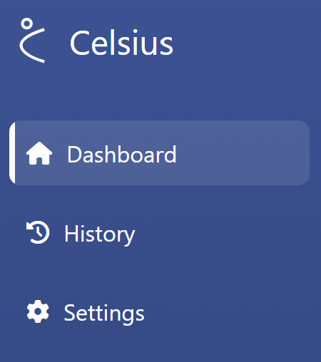
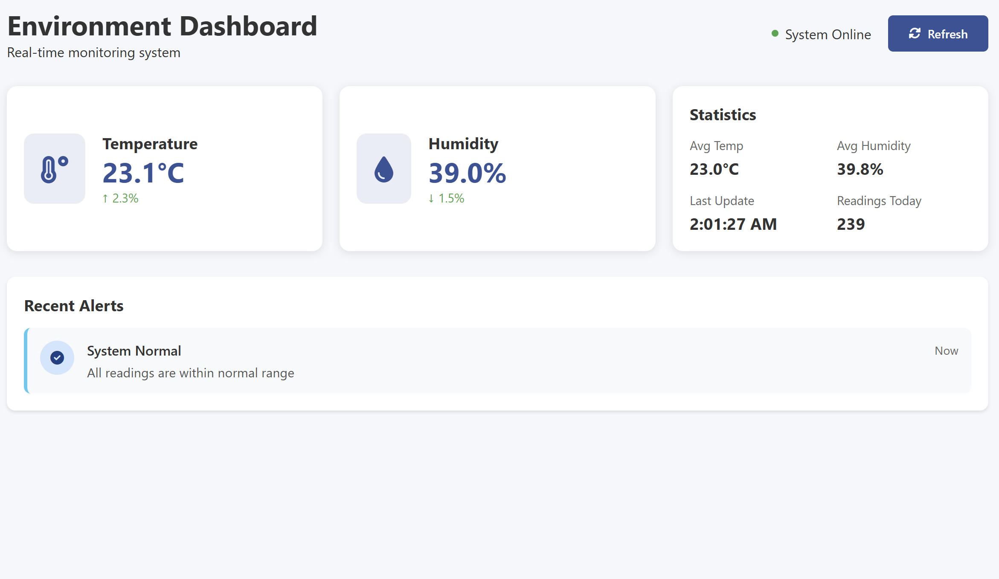
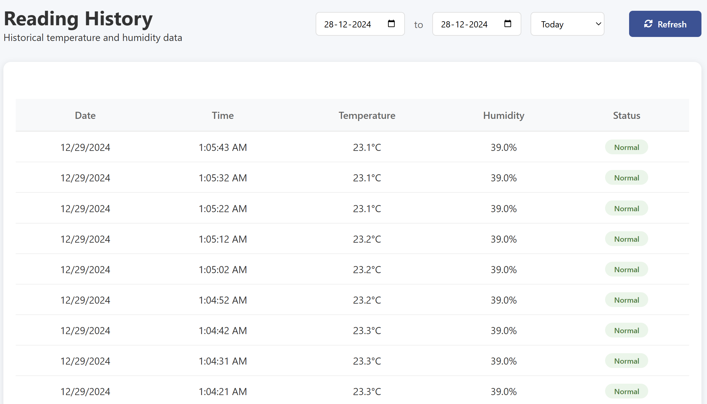
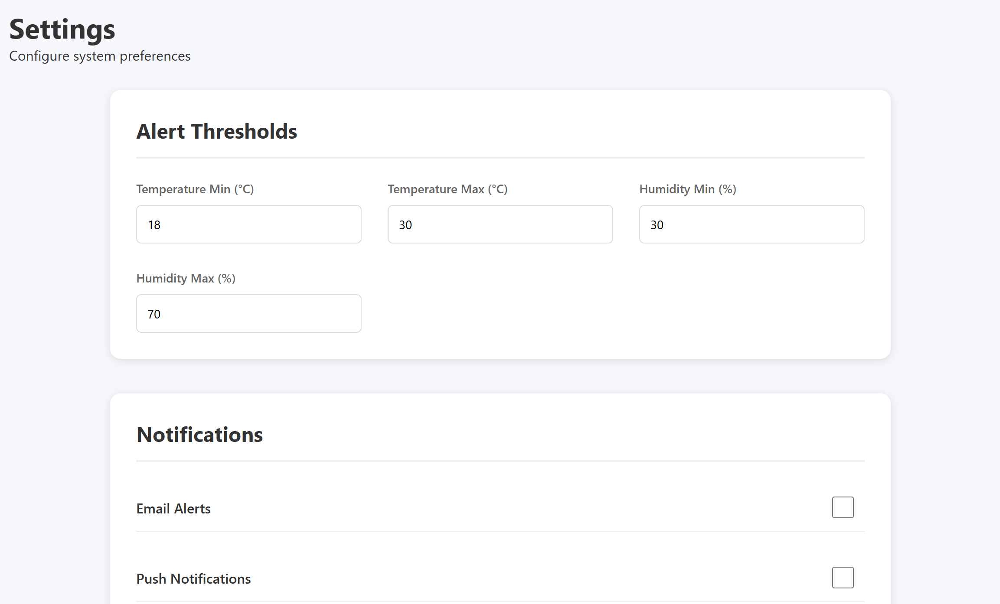
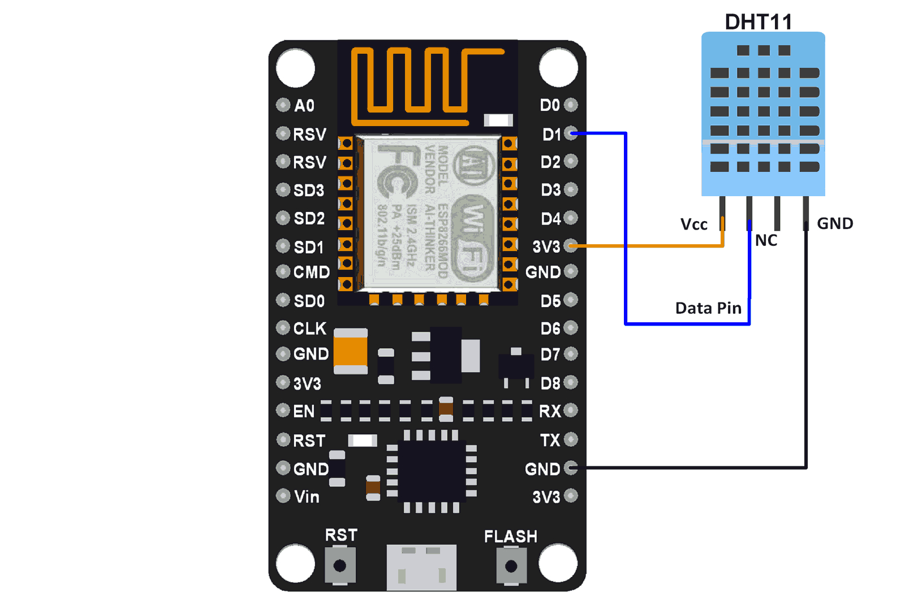

# Celsius - IoT Temperature Monitoring System

A real-time IoT temperature and humidity monitoring system using ESP8266, DHT11 sensor, MongoDB, and Vercel deployment.

## 🌡️ Overview

Celsius is a web-based monitoring system that collects temperature and humidity data from a DHT11 sensor connected to an ESP8266 microcontroller. The data is stored in MongoDB and displayed through a responsive web interface.

## 🚀 Features

- Real-time temperature and humidity monitoring
- Historical data tracking
- Responsive dashboard interface
- Alert system for threshold violations
- Mobile-friendly design

## 📱 Pages

The system consists of three main pages:



### Dashboard
The main control center showing real-time temperature and humidity readings, along with system status and recent alerts.



### History
View and analyze historical temperature and humidity data with filtering options.



### Settings
Configure system parameters, alert thresholds, and notification preferences.



## 📡 Circuit Diagram

The hardware setup consists of an ESP8266 connected to a DHT11 sensor:



### Pin Configuration
- DHT11 VCC → ESP8266 3.3V
- DHT11 DATA → ESP8266 D4 (GPIO2)
- DHT11 GND → ESP8266 GND
- 10K Resistor between VCC and DATA

## 🔧 Setup and Installation

1. **Hardware Setup**
   - Connect DHT11 sensor to ESP8266 following the circuit diagram above
   - Flash the ESP8266 with provided code
   - Configure WiFi credentials

2. **MongoDB Setup**
   ```bash
   # Create a MongoDB Atlas account
   # Create a new cluster
   # Get your connection string
   ```

3. **Project Setup**
   ```bash
   # Clone the repository
   git clone https://github.com/yourusername/celsius.git
   cd celsius

   # Install dependencies
   npm install
   ```

4. **Environment Variables**
   - Create MongoDB connection string
   - Add to Vercel environment variables:
     - `MONGODB_URI`: Your MongoDB connection string

5. **Deployment**
   ```bash
   # Deploy to Vercel
   vercel
   ```

## 🔌 API Endpoints

- `GET /api/data` - Get latest sensor readings
- `POST /api/data` - Submit new sensor readings
- `GET /api/data/history` - Get historical data
- `GET /api/data/stats` - Get statistical data

## 📄 License

This project is licensed under the MIT License - see the LICENSE file for details.

## 🤝 Contributing

Contributions are welcome! Please feel free to submit a Pull Request.

## ✨ Acknowledgements

- Font Awesome for icons
- MongoDB Atlas for database hosting
- Vercel for deployment
